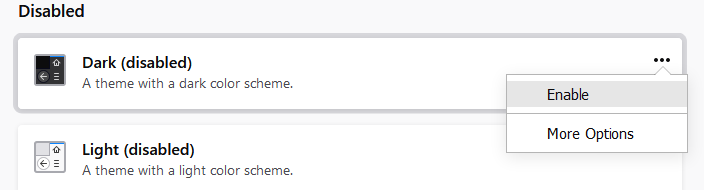
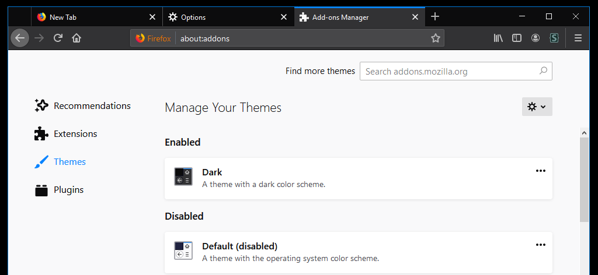

# Configure Firefox
## Enable Dark Theme
### Steps
```
Click the Firefox hamburger menu icon and select Options
In the Options tab, click on "Extensions & Themes"
Click on the "Dark (disbabled)" theme
Click on the "..." menu and select "Enable"
Close the "Add ons" and "Options" tabs
```
### Select Options Menu

### Select Themes

### Enable Dark Mode

### 

###

