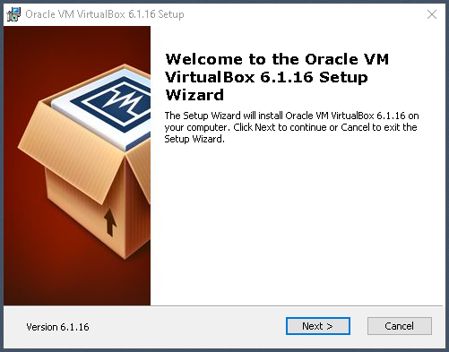
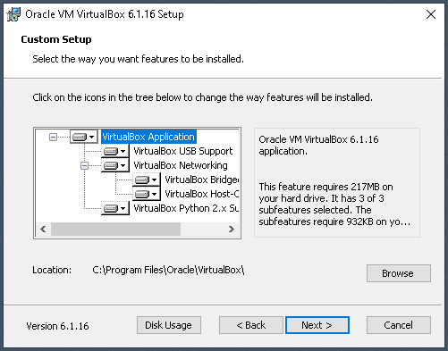
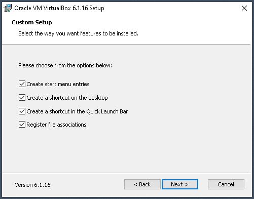
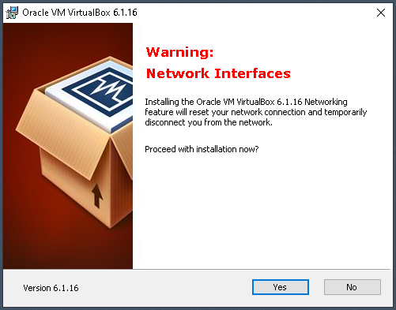
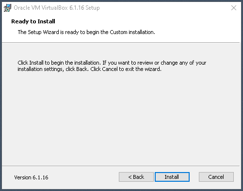
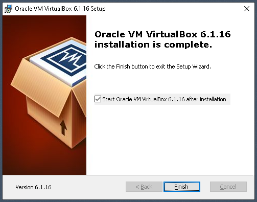
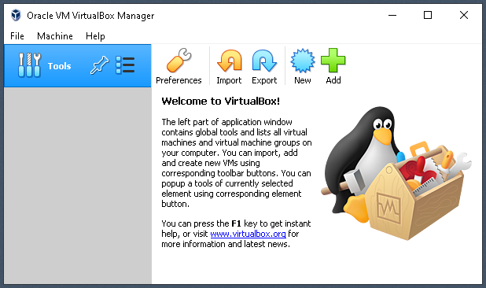

## Oracle Virtual Box

This project is about configuring and running Hercules on Linux. If you already have a Linux box set up, you can skip this step and resume at the <a href="https://github.com/davidjwalling/drinker/blob/master/docs/System-Prep.md">Preparing your Linux Environment</a> page.

On this site I document how to configure and run Hercules continuously in the cloud because I want to access my development environment at any time from practically anywhere over the Internet. These instructions can also be used to set up a virtualized Linux instance on your local computer. That is why I have included this page. Having a local Linux environment running virtually lets me test changes to my configuration before migrating them to the cloud.

You have choices if you want to run Linux virtually. I use Oracle VirtualBox. But, choices include other type-1 hypervisors like VMWare or OS-level virtualization like Docker or Windows Subsystem for Linux (WSL). I prefer VirtualBox for this project because it doesn't require Hyper-V and its control panel conveniently stays open when stopping and starting different virtual machines.

<table><tr><td>
As of this writing, Oracle VirtualBox 6.16 is the current version. 
Download the installer <a href="https://download.virtualbox.org/virtualbox/6.1.16/VirtualBox-6.1.16-140961-Win.exe">here</a>. 
Run the installer. 
For the most part, we'll accept default values in the wizard. 
Click Next.</td><td width=40%></td></tr>
<tr><td>
Accept the defaults to install all options. 
Click Next.</td><td></td></tr>
<tr><td>
Accept the defaults to create default links. 
Click Next.</td><td></td></tr>
<tr><td>
Oracle VirtuaBox installs networking drivers. 
Click Yes to accept the update of network.</td><td></td></tr>
<tr><td>
The wizard is ready to install now. 
Click Install. 
If Windows' User Account Control (UAC) asks for permission, click Yes.</td><td></td></tr>
<tr><td>
The installation has completed. 
Leave the "Start Oracle VM VirtualBox" checkbox checked. 
Click Finish.</td><td></td></tr>
<tr><td>
The VirtualBox Manager window is launched. 
That completes this stage. 
If you're going to install Osboxes Ubuntu now, leave this window open. 
We'll return to it to add a Virtual Machine definition.</td><td></td></tr>
</table>

Continue to [Osboxes Ubuntu](Osboxes-Ubuntu.md)  
Return to [README](../README.md)
