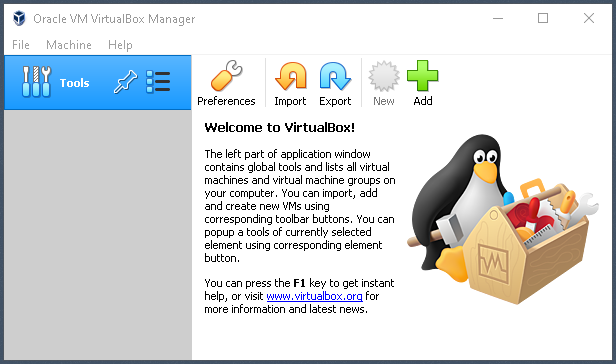
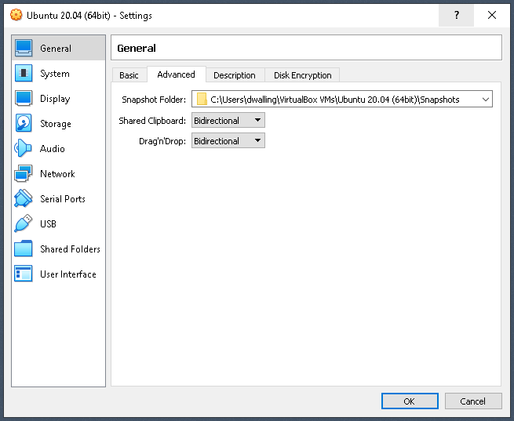

## Osboxes Ubuntu

In the previous step, we installed Oracle VirtualBox to provide a virtualization platform for a Linux environment. Now we can proceed to install Ubuntu 20.04 as a virtual machine.

There are many Linux distributions to choose from. Hercules doesn't require any specific distribution. I like Ubuntu because its user interface feels intuitive and efficient. It's software repository seems to be kept current and supports all the contemporary tools I like to use. It's not perfect. But, version 20.04 has proven to be pretty reliable in my experience. It's also the version I use for my cloud server.

Before we start, please make sure virtualization is enabled on your computer. Check the BIOS settings if necessary to make sure VT-x or AMD-V virtualization is enabled.

<table><tr><td>
Download the 64-bit Ubuntu 20.04 virtual disk image (VDI) <a href="https://sourceforge.net/projects/osboxes/files/v/vb/55-U-u/20.04/Ubnt-20.04-VB-64bit.7z/download">here</a>. This is a link to sourceforge.net, which should start the download automatically. The download is a .7z archive. If you're operating system's native zip program doesn't support .7z files, you can download 7-Zip <a href="https://www.7-zip.org/download.html">here</a>.
</td><td width=40%></td></tr>
<tr><td>
Locate the downloaded file in the Downloads folder. If using 7-Zip, right-click on the file and select the 7-Zip|Open Archive menu option to open the downloaded archive. Double-click into the 64bit folder. You should see the Ubuntu 20.04 (64bit).vdi file. Leave this window open. We'll come back to it later to expand the VDI file.</td><td> </td></tr>
<tr><td>
Now return to the Oracle VirtualBox manager window we left open in the previous step. Click the "New" icon (or use Ctrl+N) to start a new virtual machine defintion.</td><td></td></tr>
<tr><td>
Enter a name for the virtual machine. I entered "Ubuntu 20.04 (64bit)." If the name describes the distro, VirtualBox might correctly intuit the Type and Version, as shown. If not, select "Linux" and "Ubuntu (64-bit)" as the Type and Version. Pay attention to the value of the Machine Folder. VirtualBox will create a subfolder there for the VM. We're going to copy the Osboxes Ubuntu 20.04 VDI file there. Click Next.</td><td></td></tr>
<tr><td>
Now locate the Machine Folder that VirtualBox just created. In my case it's C:\Users\dwalling\VirtualBox VMs\Ubuntu 20.04 (64bit)." Drag the compressed Osboxes Unbuntu 20.04 VDI file into that folder. This will expand the compressed VDI file. The expand/copy might take a minute to complete. Once copied, you can close your 7-zip or WinZip window.</td><td></td></tr>
<tr><td>
Return to the VirtualBox Virtual Machine wizard. Enter or select an appropriate memory size for the virtual machine. I selected 3GB. Click Next.</td><td></td></tr>
<tr><td>
Select the "Use an existing virtual hard disk file" radio button. Click on the yellow folder icon. We will locate and select the downloaded Osboxes Ubuntu 20.04 VDI file.</td><td></td></tr>
<tr><td>
Click the "Add" icon on the Hard Disk Selector dialog.</td><td></td></tr>
<tr><td>
Select the expanded VDI file we just copied into the VirtualBox VMs subfolder. Click Open.</td><td></td></tr>
<tr><td>
Make sure the VDI file is selected on the Hard Disk Selector dialog. Click Choose.</td><td></td></tr>
<tr><td>
Make sure the VDI is shown in the "Hard Disk" dialog. Click Create.</td><td></td></tr>
<tr><td>
The new Ubuntu 20.04 (64bit) VM is now listed in the VirtualBox manager. Make sure it is highlighted as shown. Click the Settings (yellow cog wheel) icon.</td><td></td></tr>
<tr><td>
On the "Advanced" tab on the "General" settings dialog, select "Bidirectional" for both the "Shared Clipboard" and "Drag'n Drop" fields. This allows cut-and-paste between the host OS and the VM. Now select the "Display" settings panel.</td><td></td></tr>
<tr><td>
I increase the Video Memory to 32MB. This seems to provide good video performance at higher resolutions. Now select the "Network" settings panel.</td><td></td></tr>
<tr><td>
Make sure the "Enable Network Adapter" checkbox is checked. We'll use the default "NAT" (Network Address Translation) for the "Attached to:" setting. This usually provides your VM with the same Internet access as your host OS. This is helpful to allow updating your VM's software. However, NAT might not allow you to immediately connect to your VM from an app on your host OS. Using "bridged" networking helps in that case by assigning a distinct IP address to your VM on a specific adapter. Now click OK to save your settings.</td><td></td></tr>
<tr><td>
Our Virtual Machine is configured and ready to start. The green "Start" arrow icon can be clicked to start the VM. Note, however, that on systems where anti-virus (AV) software works by attaching a thread to running programs, VirtualBox might generate an error and refuse to start. If this happens to you, you can click the small triangular down icon adjacent to the green Start icon and select "Detachable Start" instead, as shown. For me, this has helped reduce the frequency of this error.</td><td></td></tr>
<tr><td>
When the VM starts, Ubuntu presents a selection of user accounts to choose from. The default account "osboxes" is the only one available at first and is shown on the account selection screen as "osboxes.org." Click on the "osboxes.org" user name."</td><td></td></tr>
<tr><td>
When you click on an account name, an edit field is presented to accept the account password. The default password is "osboxes.org.". Enter the password and press Enter.</td><td></td></tr>
<tr><td>
On your first login into Ubuntu, you might be prompted to setup online accounts. I'm skipping this step. Click "skip" near the upper-right corner.</td><td></td></tr>
<tr><td>
Similarly, you might be prompted to set up Canonical Livepatch. This is a useful service, but requires registration. You can set this up at a later time. So, I'm going to skip this. Click "Next" near the upper-right corner.</td><td></td></tr>
<tr><td>
Next, you might be prompted to setup automatic system reporting to Canonical. I generally don't configure my systems to ever collect and report data. Select the "No, don't send system info." Click "Next" near the upper-right corner.</td><td></td></tr>
<tr><td>
Ubuntu will prompt whether you want to expose location information. I pretty much never do this. Click "Next" near the upper-right corner.</td><td></td></tr>
<tr><td>
Ubuntu's "Software" application provides a UI for installing apps. We'll use the apt-get program to do that. Click "Done" near the upper-right corner.</td><td></td></tr>
<tr><td>
Ubuntu might advise you that updates to installed programs are available. Since Ubuntu 20.04 was released some time ago, many packages have been updated. Click "Install Now."</td><td></td></tr>
<tr><td>
Installation might require authentication. If prompted, enter the password "osboxes.org" and click "Authenticate".</td><td></td></tr>
<tr><td>
Additional updates might be available requiring further installation. This is normal. Click "Install Now." Authenticate if prompted.</td><td></td></tr>
<tr><td>
Some updates might require the VM to restart. Click "Restart Now." It's just restarting the VM, not your entire computer. When the VM restarts, click on the "osboxes.org" user and enter the password "osboxes.org" like before.</td><td></td></tr>
<tr><td>
We're going to use the Terminal application quite a lot. It can be convenient to have an icon at the ready to launch it. So, we'll set that up now. Locate and click the "Show Applications" icon.</td><td></td></tr>
<tr><td>
Click the "All" link along the bottom of the main window. Scroll down and locate the "Utilities" group icon. Click "Utilties."</td><td></td></tr>
<tr><td>
The Utilities app group window will open. Scroll down to locate "Terminal." Right-click on "Terminal" and select "Add to Favorites." Note that I had to maximize my VM window for this to work properly.</td><td></td></tr>
<tr><td>
The "Terminal" icon is now readily visible. Click it to open a Terminal window.</td><td></td></tr>
<tr><td>
In a Terminal window, a "hamburger" menu exposes a "Preferences" item. You can use Preferences to change the terminal font and other settings. For now, we'll stop here, though, and proceed to preparing the Linux environment.</td><td></td></tr>
</table>

Go back to [Oracle VirtualBox](Oracle-VirtualBox.md)  
Return to [README](../README.md)
